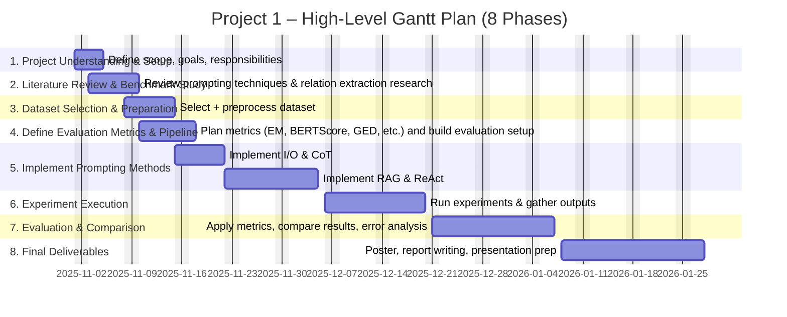

# Retrieval-Augmented Generation (RAG)

**Definition:**  
- Combines LLM + external knowledge source  
- PURPOSE enriched the model with up-to-date and factual information beyond its trained parameters
- Update the information if new data is provided

**Retriever sources:**  
- PubMed Abstracts → medicine  
- Legal documents → law  

**Process:**  
1. Input text contains entity (e.g., "CARICOM")  
2. Retriever provides context ("CARICOM is an international organization")  
3. LLM combines text + retrieved knowledge → more precise relations  

**Example:**  
- Without RAG: ("Haiti", "related to", "CARICOM") imprecise  
- With RAG: ("Haiti", "member of", "CARICOM") correct  

**Pros:** fewer hallucinations, higher factual accuracy  
**Cons:** depends on retrieval quality, more infrastructure needed  

# ReAct (Reason + Act)

**Definition:**  
- A framework that combines reasoning (thinking) with actions (search, code, API calls)
- The model doesn’t just answer → it plans, retrieves information, and then answers

**Process:**  
1. Reasoning: Think about what information is needed
2. Action: Perform an external operation (query, API request, lookup)
3. Answer: Combine thinking + retrieved results into a final output

**Example:**  
- Input: "Haiti is a member of CARICOM."  
- Step 1: Reason → check entity type  
- Step 2: Action → verify with knowledge source  
- Step 3: Output → ("Haiti", "member of", "CARICOM")  

**Pros:** less error, transparent steps, good for complex texts  
**Cons:** more complex, slower, requires tool support  

# Evaluation Metrics

**Quantitative metrics:**  
- Exact Matching → percentage of correct triplets  
- Omission Rate → missing relations  
- Hallucination Rate → invented relations  
- Redundancy → repeated triplets  

**Graph-based metric:**  
- Graph Edit Distance → number of edits to match gold-standard graph  

**Semantic metric:**  
- BERTScore → semantic similarity of predicted vs. gold-standard triplets  

## Challenges
- Ambiguity in correct triples
   - Model may output a semantically correct relation that is worded differently than groundtruth
   - e.g. Haiti is part of CARICOM instead of member of CARICOM
- Hallucinations vs. Incomplete Knowledge
   - Some outputs may contain invented facts or hallucinations, while others omit valid relations due to lack of context or retrieval
   - Challenge distinguishing "model didn't know" vs. "model made something up"

# Plan of the project

(There should be a GANT Diagram here, we can generate that online as well)
Today 1.11
2. Prelim meeting 5.11
standup 19.11
mid terms 3.12 - 17.12
poster pres 7.1
standup 14.1
written report 21.1
final poster 28.1 

# Conclusion

- Relation Extraction is key for building Knowledge Graphs  
- Prompting techniques have different strengths:  
  - I/O → simple but often inaccurate  
  - CoT → step-by-step reasoning, more transparent  
  - RAG → adds external knowledge, improves factual accuracy  
  - ReAct → combines reasoning + actions, robust but complex  

**Project goal:**  
- Evaluate which technique works best for knowledge-intensive domains  

**Key message:**  
*"The choice of prompting method determines the quality of the knowledge graph."*  
